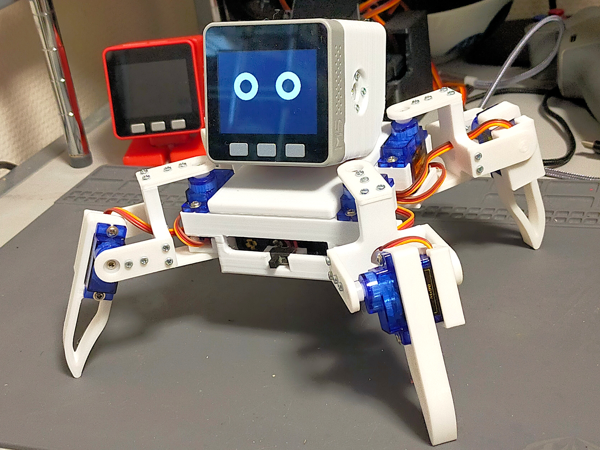
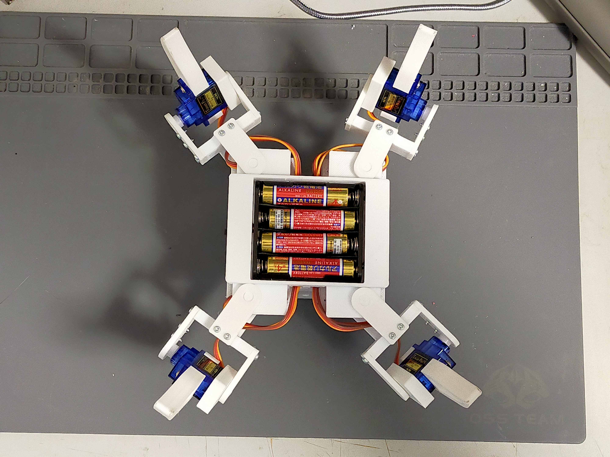
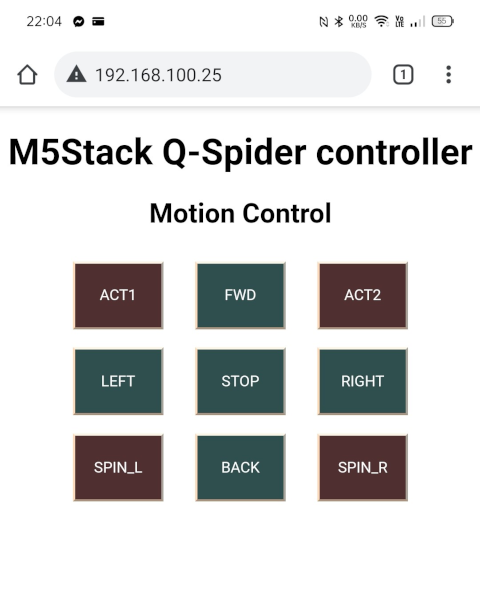

# M5Stack_QSpider

## Quadruped Spider Robot for M5Stack
It is a quadruped walking robot using M5Stack and nine toy servos (SG90). It utilizes a custom servo module board for M5Stack equipped with PCA9685.

M5Stackとトイサーボ(SG90)x9個を使用した四脚歩行ロボットです。PCA9685を搭載したM5Stack用の自作サーボモジュール基板を使用しています。

Botttom View

### 3D Print Data

The 3D print data is available below. Please print four sets of parts from the 'leg' folder, as each set corresponds to one leg.

3Dプリント用のデータは以下にあります。legフォルダ以下の部品は1本分なので4個印刷してください。

[STL Data](3dprint/)

The fully assembled main body and each leg (two types, diagonal combinations) is uploaded in STEP format. Please refer to them during assembly.

組立済の本体全体・各脚(対角の組合せで2種類)はSTEP形式でアップロードしてありますので、参考にしてください。

[STEP Data](3dprint/step)

### M5Stack Servo Driver Module M5Stack用サーボモジュール基板 
The circuit diagram and Gerber data have been published below for public access.

回路図とガーバーデータは以下で公開しています。

<https://github.com/tomorrow56/M5Stack_Servo_Driver>

### Parts needed (excluding 3D print parts)
* M5Stack Basic x 1
* [SG-90](https://akizukidenshi.com/catalog/g/gM-08761/) X 9
* [Battery Holder for 4x AA](https://akizukidenshi.com/catalog/g/gP-03087/) (For servo power)
* [NP-40 Lithium-ion Battery for Cameras](https://amzn.to/3S4qocj) or a similarly sized one (For M5Stack power)
* [Slide Switch 1 Circuit 2 Contacts](https://akizukidenshi.com/catalog/g/gP-15707/)
* M2x8mm Tapping Screws (Approximately 40)
* Wiring Lead for connections

### 必要な部品 (3Dプリント部品以外) 
* M5Stack Basic x 1
* [SG-90](https://akizukidenshi.com/catalog/g/gM-08761/) X 9
* [電池ボックス単4×4本](https://akizukidenshi.com/catalog/g/gP-03087/) (サーボ電源用)
* [カメラ用リチウムイオン電池 NP-40](https://amzn.to/3S4qocj) または同サイズのもの (M5Stack電源用)
* [スライドスイッチ 1回路2接点](https://akizukidenshi.com/catalog/g/gP-15707/)
* M2x8mmのタッピングビス(約40本)
* 配線用リード線

## ソフトウエア: Software
There are sketches for ArduinoIDE in the 'examples' folder. There are two types available for web interface and ESP-NOW.

ArduinoIDE用のスケッチがexample以下にあります。Webインターフェース用とESP-NOW用の2種類があります。

### Controler with Web Interface Webインターフェース
It starts as a WiFi access point and can be controlled from a web browser.

WiFiのアクセスポイントとして起動し、Webブラウザからコントロールできます。

### Controller for ESP-NOW mode ESP-NOW用コントローラ
The source code for the ESP-NOW controller is available below. Here, a modified Famicom controller is used.

ESP-NOW用コントローラのソースコードは以下にあります。ここではファミコン用コントローラを改造して使用しています。

<https://github.com/tomorrow56/M5AtomPad>

### Protopedia
<https://protopedia.net/prototype/2464>
