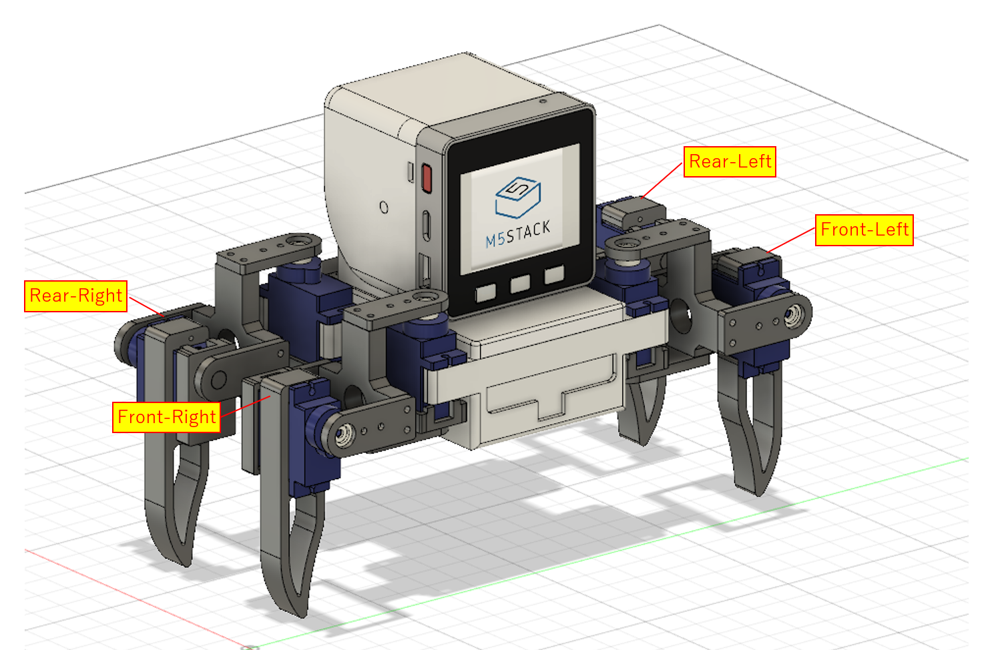

# M5Stack_QSpider

## Quadruped Spider Robot for M5Stack

4 x AAA batteries can be used to power the servo.

M5Stackとトイサーボ(SG90)x9個を使用した四脚歩行ロボットです。
PCA9685を搭載したM5Stack用の自作サーボモジュール基板を使用しています。

### 3D Print Data
[STL Data](3dprint/)
[STEP Data](3dprint/step)

Body is designed by Fusion360

### サーボモジュール基板: M5Stack Servo Driver Module
回路図とガーバーデータは以下で公開しています。
<https://github.com/tomorrow56/M5Stack_Servo_Driver>

### 必要な部品 (3Dプリント以外)
M5Stack Basic x 1
[SG-90](https://akizukidenshi.com/catalog/g/gM-08761/) X 9個
[電池ボックス単4×4本](https://akizukidenshi.com/catalog/g/gP-03087/) サーボ電源用
[カメラ用リチウムイオン電池 NP-40](https://amzn.to/3S4qocj) または同じくらいのサイズのもの M5Stackの電源用
[スライドスイッチ 1回路2接点](https://akizukidenshi.com/catalog/g/gP-15707/)
M2x8mmのタッピングビス x 40本くらい
配線用リード線

## ソフトウエア

ArduinoIDE用のスケッチがexample以下にあります。
Webインターフェース用とESP-NOW用の2種類があります。

Controllable with Web Interface

Controller for ESP-NOW mode: 専用Controllerは以下にあります。

https://github.com/tomorrow56/M5AtomPad

### Protopedia
https://protopedia.net/prototype/2464
